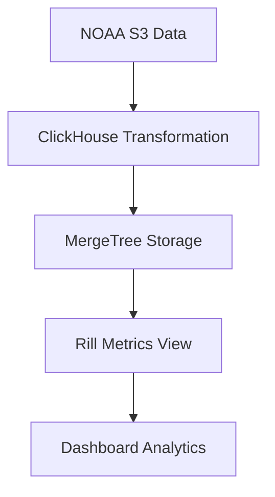

# Data Modeling Guide: ClickHouse ETL with NOAA Weather Data Example

We use S3 source with ClickHouse as engine, and Rill for visualization.

This example demonstrates advanced data modeling strategies for real-time analytics using ClickHouse and Rill. We showcase how to maximize ClickHouse's capabilities for data transformation while keeping Rill focused on visualization and last-mile analytics.


## Quick Installation
> **This is a clone of https://github.com/rilldata/rill-examples** and added for Weather-demo data
> please check the readme for how to install and setup with env variables

This project contains example Rill project with:
- ClickHouse configured as the default OLAP engine
- An incremental source that ingests Hive-partitioned Parquet files from S3
- A source that ingests a lookup table from Postgres and creates it as a ClickHouse [dictionary](https://clickhouse.com/docs/sql-reference/dictionaries)
- A metrics view with a dimension that does a query-time lookup in the dictionary table

### How to configure

1. Copy `.env.example` to `.env` and populate it with S3 and Postgres credentials
2. Adapt the source and metrics definitions to your actual data locations and schemas
3. When you are ready to deploy the project, configure `clickhouse_dsn_prod` in `.env` to the DSN of a production ClickHouse cluster. This setting is not needed in local development because Rill will automatically start Clickhouse as a subprocess.


## Architecture Overview



## Data Flow and Incremental Loading Behavior

### How Rill Manages ClickHouse Data

When you run `rill start`, here's what happens:

1. **ClickHouse Instance**: Rill starts a managed ClickHouse server (local development mode)
2. **Partition Discovery**: Rill evaluates the partition SQL: `SELECT arrayJoin(['2020', '2021', '2022']) AS year`
3. **Incremental Loading**: For each partition, Rill checks if data exists and is current
4. **Data Persistence**: ClickHouse stores transformed data in MergeTree tables that persist across restarts

### Incremental Strategy: `partition_overwrite`

```yaml
output:
  incremental_strategy: partition_overwrite
  partition_by: __partition
```

**Key Behaviors:**
- **First Run**: All partitions (2020, 2021, 2022) are loaded from S3
- **Subsequent Runs**: Only changed partitions are reloaded
- **Partition Isolation**: Each year can be refreshed independently
- **Atomic Updates**: `partition_overwrite` ensures clean data replacement per partition

**Data Persistence:**
- ClickHouse data survives Rill restarts
- Only refresh occurs if source data changes or manual refresh is triggered
- Hourly cron refresh: `cron: "0 * * * *"` (can be disabled for development)

## Data Schema and Transformation

### Raw NOAA CSV Schema
The original NOAA weather data comes as CSV files with 8 columns:

| Column | Type | Example | Description |
|--------|------|---------|-------------|
| c1 (column0) | VARCHAR | AE000041196 | Weather Station ID |
| c2 (column1) | BIGINT | 20220101 | Date (YYYYMMDD format) |
| c3 (column2) | VARCHAR | TAVG | Measurement Type (TMIN, TMAX, PRCP, TAVG, etc.) |
| c4 (column3) | BIGINT | 204 | Measurement Value (in tenths of units) |
| c5 (column4) | VARCHAR | H | Measurement Flag |
| c6 (column5) | VARCHAR | NULL | Quality Flag |
| c7 (column6) | VARCHAR | S | Source Flag |
| c8 (column7) | VARCHAR | NULL | Observation Time |

**Sample Raw Data:**
```
AE000041196,20220101,TAVG,204,H,,S,
AGE00147708,20220101,TMIN,73,,,S,
AGE00147708,20220101,PRCP,0,,,S,
```

### Transformed ClickHouse Schema
ClickHouse transforms the raw CSV into an analytics-ready schema:

| Column | Type | Example | Description |
|--------|------|---------|-------------|
| __partition | String | 2022 | Year partition identifier |
| __load_time | DateTime | 2025-09-03 16:50:00 | ETL load timestamp |
| station_id | String | AE000041196 | Weather station identifier |
| measurement_date | Date | 2022-01-01 | Parsed measurement date |
| measurement_type | String | TAVG | Type of measurement |
| measurement_value | Float32 | 20.4 | Scaled measurement (÷10) |
| measurement_flag | String | H | Data collection flag |
| quality_flag | String | NULL | Data quality indicator |
| source_flag | String | S | Data source identifier |
| observation_time | String | NULL | Time of observation |
| measurement_year | UInt16 | 2022 | Extracted year for fast filtering |
| measurement_month | UInt8 | 1 | Extracted month for analytics |
| measurement_day_of_year | UInt16 | 1 | Day of year (1-366) |
| temp_min_celsius | Float32 | NULL | Temperature min (only for TMIN) |
| temp_max_celsius | Float32 | NULL | Temperature max (only for TMAX) |
| precipitation_mm | Float32 | 0.0 | Precipitation (only for PRCP) |

### Measurement Types in NOAA Data
Common measurement types include:
- **TMIN**: Daily minimum temperature (°C × 10)
- **TMAX**: Daily maximum temperature (°C × 10)  
- **TAVG**: Daily average temperature (°C × 10)
- **PRCP**: Daily precipitation (mm × 10)
- **SNOW**: Daily snowfall (mm × 10)
- **SNWD**: Snow depth (mm × 10)

## ClickHouse Transformation Strategy

### Raw CSV to Analytics-Ready Schema

We perform heavy ETL transformations directly in ClickHouse to minimize data movement:

```sql
SELECT
    -- Partition and load metadata
    '{{ .partition.year }}' AS __partition,
    now() AS __load_time,
    
    -- Transform raw CSV columns to proper NOAA schema
    COALESCE(c1, 'UNKNOWN') AS station_id,
    COALESCE(toDate(toString(c2)), toDate('1900-01-01')) AS measurement_date,
    COALESCE(c3, 'UNKNOWN') AS measurement_type,
    toFloat32(c4) / 10.0 AS measurement_value, -- Convert from tenths
    
    -- Add derived analytics fields
    toYear(toDate(toString(c2))) AS measurement_year,
    toMonth(toDate(toString(c2))) AS measurement_month,
    
    -- Split measurement types for analysis
    CASE 
        WHEN c3 = 'TMIN' THEN toFloat32(c4) / 10.0
        ELSE NULL 
    END AS temp_min_celsius,
    CASE 
        WHEN c3 = 'TMAX' THEN toFloat32(c4) / 10.0  
        ELSE NULL
    END AS temp_max_celsius
FROM s3('s3://noaa-ghcn-pds/csv.gz/{{ .partition.year }}.csv.gz', 'CSV')
```

### Transformation Benefits

1. **Data Type Conversion**: String dates → Date types, scaled measurements
2. **Null Safety**: `COALESCE` ensures non-nullable sorting keys
3. **Derived Fields**: Pre-computed year/month for fast filtering
4. **Split Columns**: Separate temperature/precipitation columns for analysis
5. **Unit Conversion**: NOAA tenths → actual values (°C, mm)

## MergeTree Optimization

### Storage Engine Configuration

```yaml
output:
  engine: MergeTree
  order_by: (measurement_date, station_id, measurement_type)
  primary_key: (measurement_date, station_id)
```

### Why This Ordering?

1. **measurement_date**: Most queries filter by time ranges
2. **station_id**: Geographic analysis requires station grouping  
3. **measurement_type**: Different metrics (TMIN, TMAX, PRCP) often queried together

### Performance Benefits

- **Range Queries**: Fast date range filtering using primary index
- **Station Analysis**: Efficient per-station aggregations
- **Data Skipping**: ClickHouse skips irrelevant data blocks
- **Compression**: Similar data clustered together compresses better

## Partitioning Strategy

### Yearly Partitions

```yaml
partitions:
  sql: SELECT arrayJoin(['2020', '2021', '2022']) AS year
```

### Partition Benefits

1. **Independent Refreshes**: Update 2022 data without touching 2020/2021
2. **Query Pruning**: Queries with year filters only scan relevant partitions
3. **Parallel Processing**: Multiple years can be loaded simultaneously
4. **Storage Management**: Easy to drop old years or add new ones

## Last-Mile Analytics in Rill

### Metrics View Schema
Rill creates a time-series analytics view with the following structure:

**Dimensions (Grouping Fields):**
| Dimension | Type | Description | Use Case |
|-----------|------|-------------|----------|
| station_id | String | Weather Station ID | Geographic analysis, station comparison |
| measurement_type | String | Type of measurement | Filter by TMIN, TMAX, PRCP, etc. |
| measurement_year | Integer | Year of measurement | Year-over-year analysis |
| measurement_month | Integer | Month of measurement | Seasonal trends |
| quality_flag | String | Data quality indicator | Filter reliable measurements |

**Measures (Aggregated Metrics):**
| Measure | Expression | Description | Dashboard Use |
|---------|------------|-------------|---------------|
| record_count | count(*) | Total number of records | Data volume tracking |
| avg_temperature_min | avg(temp_min_celsius) | Average minimum temperature | Climate analysis |
| avg_temperature_max | avg(temp_max_celsius) | Average maximum temperature | Heat trend analysis |
| total_precipitation | sum(precipitation_mm) | Total precipitation | Rainfall totals |
| avg_precipitation | avg(precipitation_mm) | Average precipitation | Climate patterns |
| station_count | countDistinct(station_id) | Number of reporting stations | Data coverage |
| measurement_value_avg | avg(measurement_value) | Average raw measurement value | General trends |

### Metrics View Configuration

```yaml
type: metrics_view
model: events
timeseries: measurement_date
smallest_time_grain: day

dimensions:
  - name: station_id
    display_name: Weather Station
  - name: measurement_type  
    display_name: Measurement Type
  - name: measurement_year
    display_name: Year

measures:
  - name: avg_temperature_min
    display_name: Average Min Temperature (°C)
    expression: avg(temp_min_celsius)
  - name: total_precipitation
    display_name: Total Precipitation (mm)
    expression: sum(precipitation_mm)
```

### Why Minimal Rill Processing?

- **ClickHouse Heavy Lifting**: Complex transformations done in source model
- **Rill Aggregations**: Simple expressions for dashboard metrics
- **Performance**: Pre-computed fields enable fast dashboard queries

## Advanced ClickHouse Features Used

### 1. Remote Data Access
```sql
FROM s3('s3://noaa-ghcn-pds/csv.gz/{{ .partition.year }}.csv.gz', 'CSV')
```
- Direct S3 access without data copying
- Automatic CSV parsing and compression handling

### 2. Template Variables
```sql  
'{{ .partition.year }}' AS __partition
```
- Dynamic SQL generation per partition
- Enables flexible data source patterns

### 3. Type Safety
```sql
COALESCE(toDate(toString(c2)), toDate('1900-01-01'))
```
- Handles malformed dates gracefully
- Ensures non-nullable sorting keys

### 4. Analytical Functions
```sql
toYear(toDate(toString(c2))) AS measurement_year
```
- Pre-compute common aggregation dimensions
- Faster dashboard filtering and grouping

## Performance Characteristics

### Dataset Scale
- **3 Years of Data**: 2020-2022 NOAA weather measurements
- **~30+ Million Records**: Global weather station data
- **Multiple Measurement Types**: Temperature, precipitation, snow, etc.

### Query Performance
- **Sub-second Response**: Dashboard queries return in milliseconds
- **Efficient Aggregations**: Pre-computed fields enable fast GROUP BY
- **Index Usage**: Date/station ordering matches common query patterns

## Best Practices Demonstrated

1. **Heavy ETL in ClickHouse**: Minimize data movement, maximize source processing
2. **Partition by Time**: Year-based partitions for time-series data
3. **Order by Query Patterns**: Optimize for most common query shapes  
4. **Null Safety**: Use COALESCE for reliable sorting keys
5. **Pre-compute Dimensions**: Extract year/month for fast filtering
6. **Type Conversions**: Handle scaling and unit conversions at load time

## Extension Opportunities

### Adding More Years
```yaml
partitions:
  sql: SELECT arrayJoin(['2020', '2021', '2022', '2023']) AS year
```

### Historical Data Loading
```yaml
partitions:
  sql: SELECT toString(number + 1900) AS year FROM numbers(124) -- 1900-2023
```

### Advanced Analytics
- Add weather station geographic lookups
- Implement climate trend calculations  
- Create seasonal aggregations
- Build weather pattern detection

This example demonstrates how to leverage ClickHouse's power for complex data transformations while maintaining clean separation between data processing (ClickHouse) and visualization (Rill).
